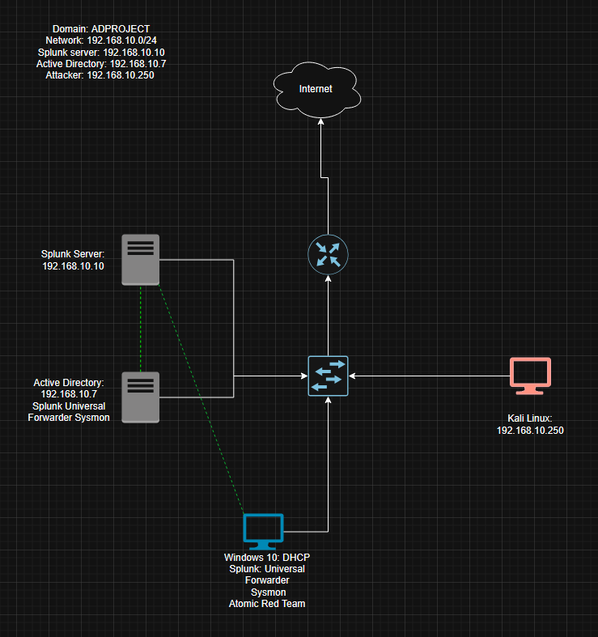
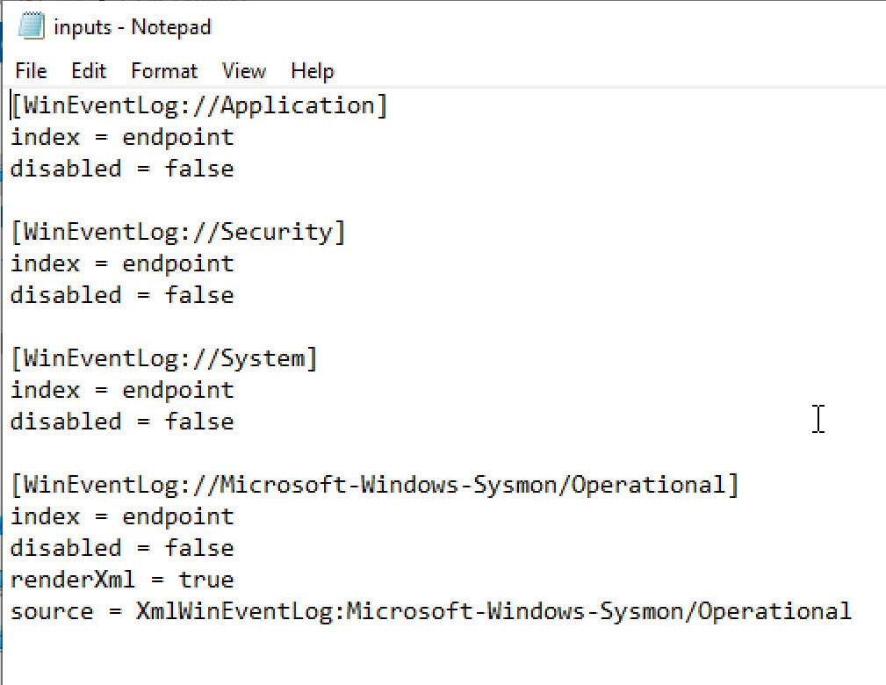
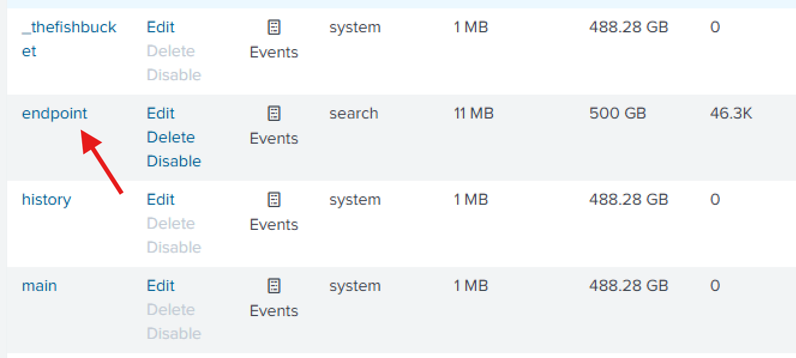
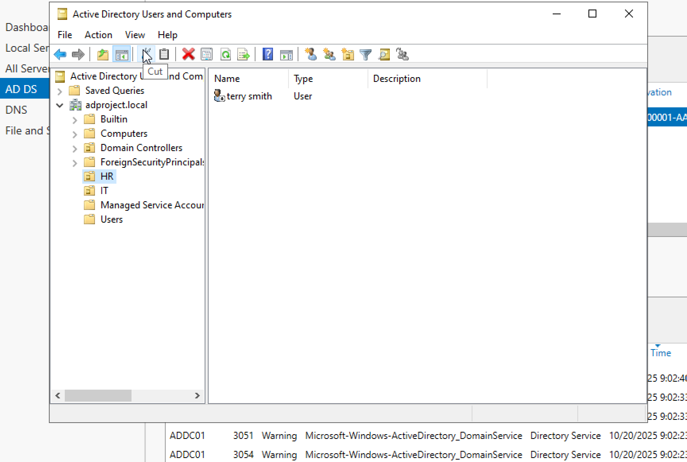
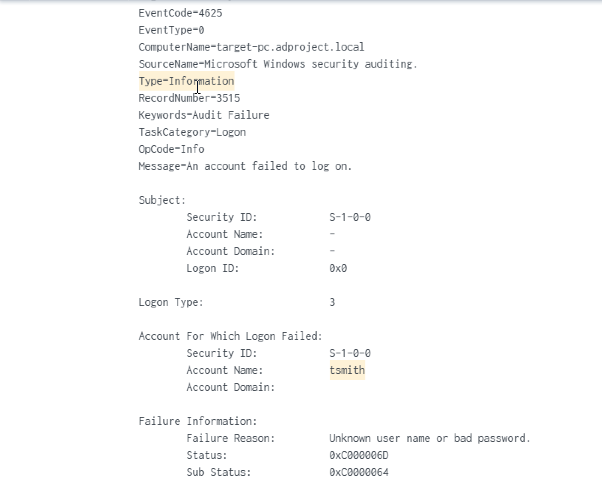

# Active Directory Project

In this project, I used Virtual Box to setup an AD environment inside a Windows Server 2022 VM, Configured a target Windows 10 machine and Kali Linux VM, and a Splunk instance for ingesting events and analyzing telemetry. The initial draw up, with all VM's and installed software, is depicted below:

After setting up a NAT network in Virtual Box so my vm's could communicate with each other/access the internet, I configured a static IP address for the Splunk server:

Once I installed sysmon and Splunk Universal Forwarder on the Windows 10 target VM and Windows Server 2022 AD VM, it was time to create an inputs.conf file in the local directory of the Universal Forwarder to send Application, Security, System and Sysmon logs to the Splunk server, pointing to the index "endpoint" as well as creating an endpoint index within Splunk and configuring a receving point, which is 9997 by default: 

To put on the finishing touches before we can begin attacking the target machine, I installed Active Directory Domain Services on the Windows Server 2022 VM, promoted the server to a DC, created a new forest with domain name "ADPROJECT", created some OU's like IT and HR along with some user accounts Jerry Smith and Terry Smith, then finally joining the Windows 10 target machine to the AD domain

Now that we have all the pieces in place, we can finally begin launching attacks on the Windows 10 target machine. There are many brute force tools you can use, I decided to use hydra with this command: hydra -l tsmith -P passwords.txt rdp://192.168.10.100/32, indicating we want to brute force attempt via RDP to account jsmith using passwords listed in the passwords.txt file.

As you can see at the very top, the event code for this specific alert was 4625, which indicates a failed log in attempt to tsmith's account, since I did not include their password in the passwords.txt file. Now that we can officially see the telemetry of the attack, I can now launch different attacks on the target machine and see how splunk detects the attack and how the target machine reacts! There was a lot more behind the scenes to this lab, however that was mostly setting up the vm's. I mainly wanted to show experience with VM and splunk configuration, as well as some red team experience with Kali Linux.

