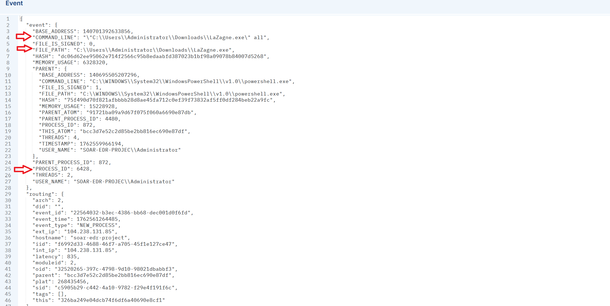
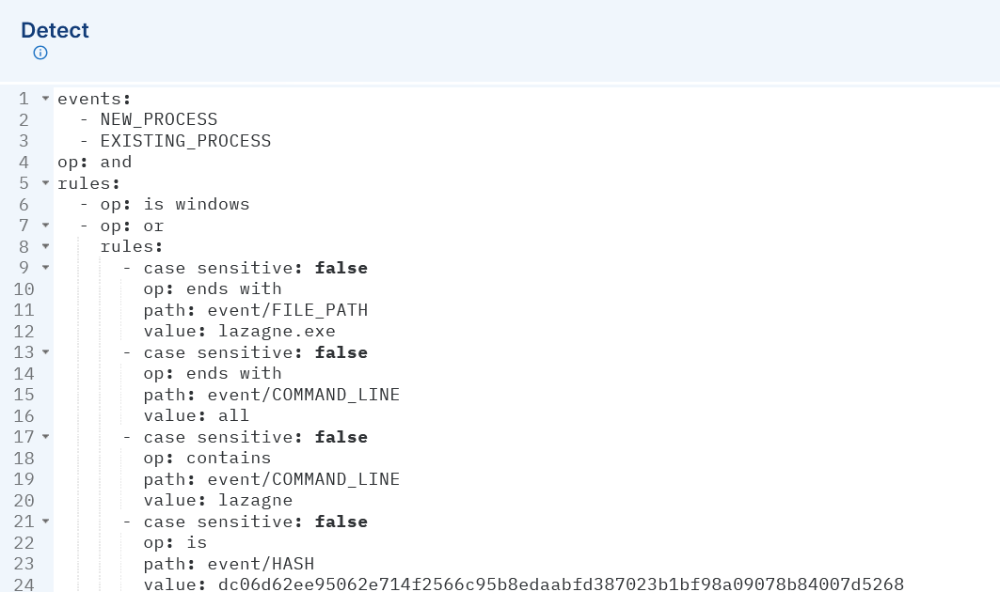
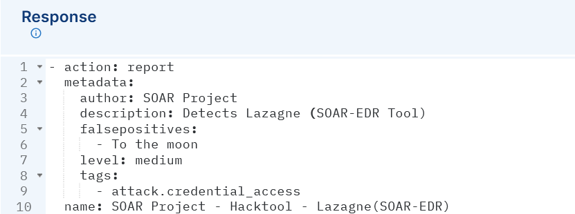
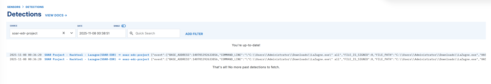
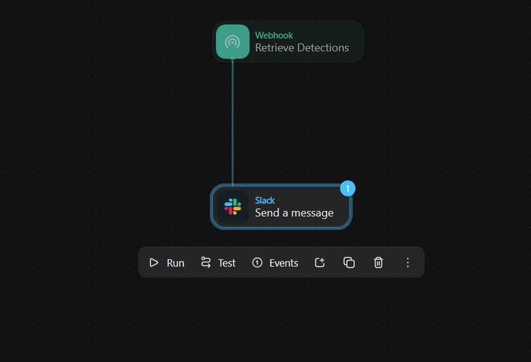
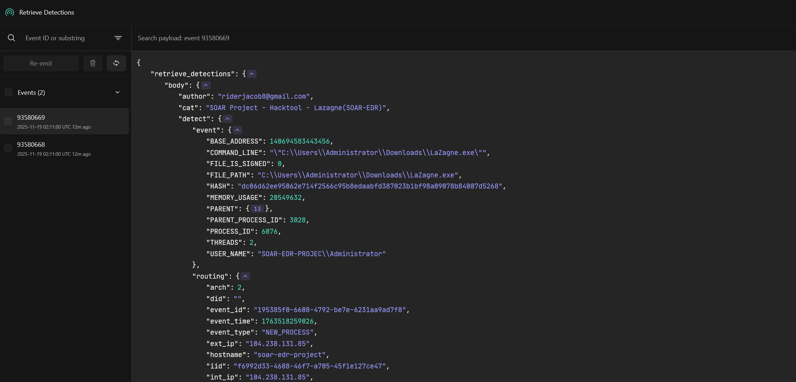
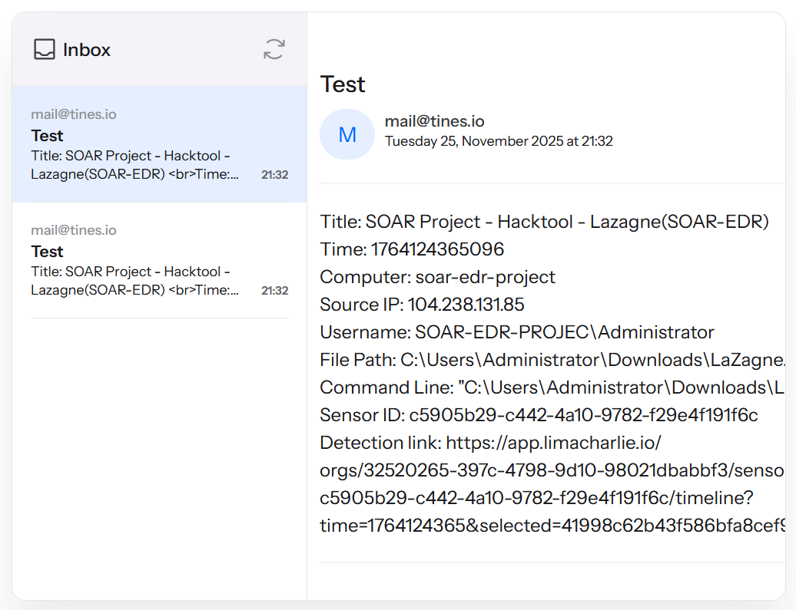
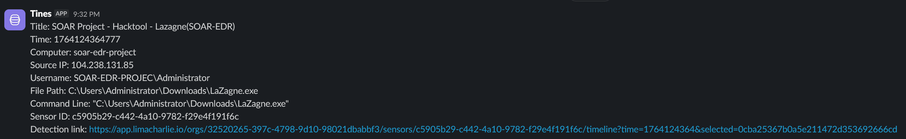
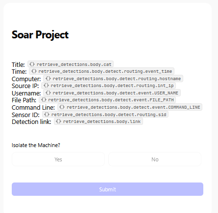

# SOAR Project

For this project, I wanted to create a playbook within Tines, and AI orchestration platform, that will send a Slack message and an email with details about a detection from LimaCharlie. Next, I will prompt the user if they want to isolate the machine based off the details received. Finally, I would isolate the machine using LimeCharlie if the user agrees, or send a message indicating no isolation if they decline. I did my best to draw that up here:


## Tools Setup

Using Vultr, a VM cloud provider, I configured a Windows VM. As I waited for that to build, I would need to create an installation key and the sensor key in order to install LimaCharlie on the Windows VM. After the VM is built, I'll head over to it and use the following Powershell command in the downloads directory to install LimaCharlie (Replace executable file and installation key with their respective components):

```
  (executable file) -i (installation key)
```


In order for LimaCharlie to detect a hacktool, we need to download Lazagne from the Lazagne Project on their GitHub. Lazagne is an open source application that retrieves passwords stored on a local computer. We verify that its downloaded with Powershell and LimaCharlie:
```
  .\LaZagne.exe
```



The Arrows in the screenshot above indicate some important information we can use to create the detection and response rules within LimaCharlie.

## Detect Rule
The Detect rule's logic is as follows:
* The event type must be either New_Process or Existing_Process AND must be windows
* file_path ends with lazagne.exe
* OR command_line ends with all
* command_line contains lazagne
* OR hash == lazagne hash

That comes out to look like this:



## Response Rule
Within the response rule you'll see the action "report" this just means that if a certain event meets the criteria for the detection, an event will be generated in the detection tab in LimaCharlie:



Now lets see if the rules we created works. To do this, we'll use the command 
```
  .\LaZagne.exe all
```
And we see detections with the rule we created in LimaCharlie!:



## Slack and Tines setup

Slack is very straightforward to setup, just creating a free account, creating a new channel called "alerts" and linking our Slack credentials to the Tines story. Tines is where a majority of the setup work is going. First we will need to link our Tines story to LimaCharlie and our LimaCharlie credentials to Tines. This is done in LimaCharlie by going to Outputs > Add Output > Detections > Tines. When it asks for our Destination Host, we will link the url from the webhook in the picture below.



Now lets use that same command we used above to generate another detection to see if we get it in our Tines story:
```
  .\LaZagne.exe all
```



We have now successfully linked LimaCharlie to our Tines story!

## Tines Final Look

Below is the complete story on Tines. I will break it down section by section:


### Send Email

For the email portion, I retrieved some info on the detections and configured the email to have the following info:
* Time
* Computer
* Source IP
* Username
* File Path
* Command Line
* Sensor ID
* Detection Link

This is what it looks like in the Email:



### Slack message

All the slack messages in this story are essentially copy and pasted, with differing messages for each. For the Slack message before we go through the user prompt, we just want the same info as above sent to our Slack:



### User Prompt

For the user prompt, we are sending the user some info and asking them if they want to isolate the machine:



First, we say no, we do NOT want to isolate the machine. This is the result and the end of the yes/no scenario:


