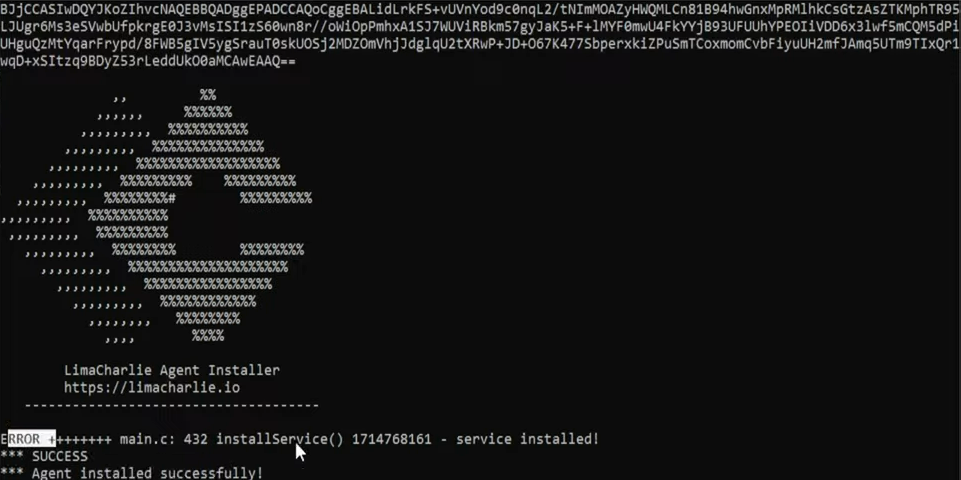
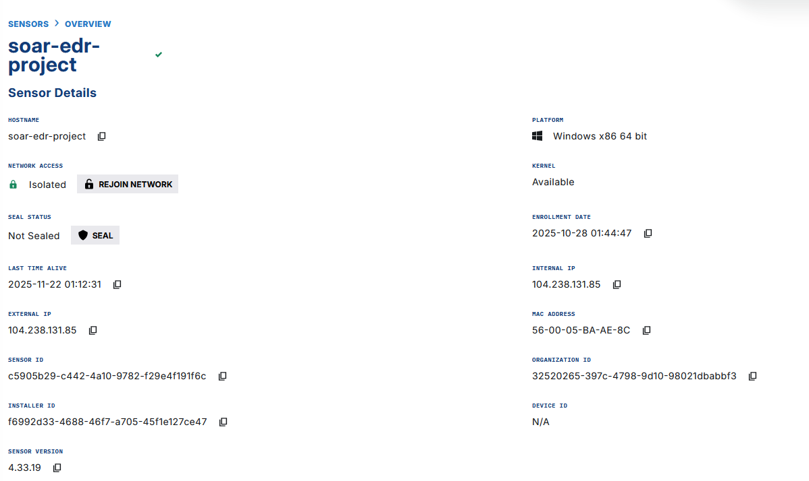
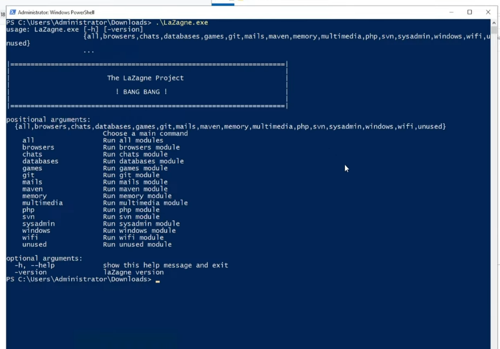

# SOAR Project

For this project, I wanted to create a playbook that will send a Slack message and an email with details about a detection from LimaCharlie. Next, I will prompt the user if they want to isolate the machine based off the details received. Finally, I would isolate the machine using LimeCharlie if the user agrees, or send a message indicating no isolation if they decline. I did my best to draw that up here:


Using Vultr, a VM cloud provider, I configured a Windows VM. As I waited for that to build, I would need to create an installation key and the sensor key in order to install LimaCharlie on the Windows VM. After the VM is built, I'll head over to it and use the following Powershell command in the downloads directory to install LimaCharlie (Replace executable file and installation key with their respective components):

```
  (executable file) -i (installation key)
```



In order for LimaCharlie to detect a hacktool, we need to download Lazagne from the Lazagne Project on their GitHub. Lazagne is an open source application that retrieves passwords stored on a local computer. We verify that its downloaded with Powershell:
```
  .\LaZagne.exe
```


